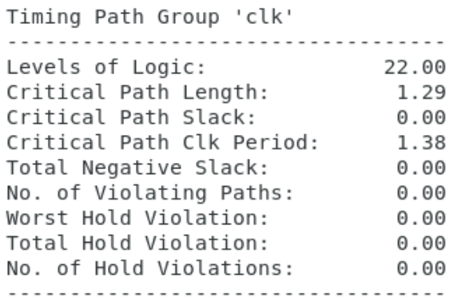
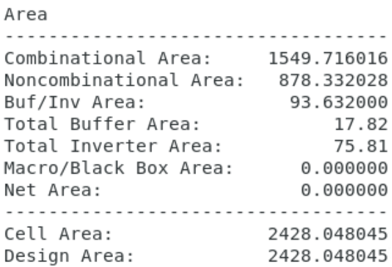
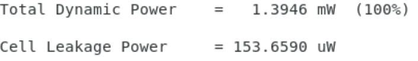

# SIMAX

A SIMD-Based Many-Core Accelerator--specifically designed for MVMs in quantized Transformer inference. SIMAX enables a configurable RTL-to-GDSII hardware implementation flow. Its parameterized hardware template allows designers to explore a wide spectrum of trade-offs across performance, power efficiency, and area scalability, from small edge deployments to large-scale many-core configurations.

## Project Layout

```
.
├─ figs/                  # Figures, screenshots
├─ layout/                # Innovus
├─ lef/                   # NangateOpenCellLibrary.lef
├─ lib/					  # 45nm Timing library
├─ rtl/                   # Verilog source
├─ setup/				  # for innovus import design
├─ synthesis/            # Generate netlist, sdc, and PPA reports (created by the flow)
│  └─ dc-template.tcl    # DC script (edit clk_period here)
│  ├─ top.vfs            # Verilog Filelist for Synthesis (no testbench)
│  └─ top.vfv            # Verilog Filelist for Verification (with testbench)
├─ tech/				  # freepdk45: An open-source predictive 45nm pdk
└─ README.md
```


## Synthesis


### Prerequisites

* Synopsys **Design Compiler** (`dc_shell` or `dc_shell -tcl`) in your `PATH`
* GNU Make

---

### Configure SIMAX Parameters

Before running synthesis, confirm your SIMAX template dimensions (e.g., **rows**, **columns**, **clock cycles/latency**).
Set them via `parameter` values in `top.v`:

* `CYCLE_W` = ceiling (log2(ROWS+COLS+1))

---

### Quick Start

1. **Navigate** to your synthesis folder (project root with the `Makefile`).
2. **Edit** `top.vfs` (synthesis) and `top.vfv` (verification) as needed.
3. **Check** SIMAX dimensions (rows/cols/cycles) match your intended configuration.
4. **Run**: `make NAME=top synth`
5. **Review output**: QoR and power are printed to terminal **and** saved to: `top.rpt`
6. **Adjust clock** based on slack. Edit `dc-template.tcl`:

* Negative slack ⇒ increase `clk_period` (slow down).
* Comfortable positive slack ⇒ try decreasing `clk_period` (speed up).

7. Re-run `make NAME=top synth`.
8. Remove generated outputs `make NAME=top cleanall`

---
### Results
*Figure 1.* Timing.
<a   align="center" >
  
</a>
*Figure 2.* Area.
<a  align="center">
  
</a>
*Figure 3.* Power.
<a   align="center">
  
</a>
 


---

### Troubleshooting

* **Unresolved modules**: Fix paths/entries in `.vfs`.
* **Top not found**: Ensure `NAME=<top_module>` matches your RTL top.
* **Negative slack**: Relax `clk_period` or optimize constraints/RTL.
* **No power report**: Confirm libraries include power data and script calls `report_power`.
